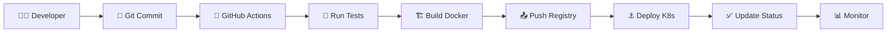

# 🚀 Meu Projeto GitOps

Dashboard moderno com deploy automático usando GitHub Pages.

## 🌐 Acesso Online
- **Website**: https://rickOsantos.github.io/gitops

## 🛠️ Tecnologias
- HTML5, CSS3, JavaScript
- GitHub Pages
- GitHub Actions (CI/CD)
- PWA Support

## 🚀 Deploy Automático
Cada commit na branch `main` faz deploy automático!


# 🚀 Projeto GitOps - Dashboard Moderno

[](https://github.com/rickOsantos/gitops/actions)
[](https://github.com/rickOsantos/gitops/actions)
[](https://opensource.org/licenses/MIT)

> Um projeto completo de GitOps com dashboard moderno, deploy automático e monitoramento em tempo real.

## 📸 Preview


## ✨ Features

- 🎨 **Dashboard Moderno**: Interface responsiva com design glassmorphism
- 🚀 **Deploy Automático**: CI/CD com GitHub Actions
- ⚓ **Kubernetes Ready**: Manifests completos para K8s
- 🐳 **Docker Support**: Containerizado e otimizado
- 📊 **Monitoramento**: Métricas em tempo real
- 🔒 **Segurança**: Scans automatizados e best practices
- 🌐 **PWA**: Progressive Web App com offline support
- 📱 **Responsivo**: Funciona perfeitamente em mobile
- 🔧 **Infraestrutura como Código**: Terraform incluído

## 🛠️ Tecnologias

| Categoria | Tecnologias |
|-----------|-------------|
| **Frontend** | HTML5, CSS3, JavaScript (Vanilla) |
| **Containerização** | Docker, Docker Compose |
| **Orquestração** | Kubernetes, Helm |
| **CI/CD** | GitHub Actions |
| **Monitoramento** | Prometheus, Grafana |
| **Infraestrutura** | Terraform |
| **Segurança** | CodeQL, Trivy |

## 🚀 Quick Start

### 1. Clone e Configure

```bash
# Clone o repositório
git clone https://github.com/rickOsantos/gitops.git
cd gitops

# Torne os scripts executáveis
chmod +x scripts/*.sh

# Execute setup inicial
./scripts/setup.sh
```

### 2. Escolha sua Opção de Deploy

#### 🌐 Opção 1: GitHub Pages (Mais Simples)

1. **Configure GitHub Pages**:
   - Vá em Settings → Pages
   - Source: GitHub Actions
   - Push para `main` → Deploy automático

2. **Configure Domínio Customizado** (opcional):
   - Settings → Pages → Custom domain
   - Adicione seu domínio: `seudominio.com`

3. **Acesse**: `https://rickOsantos.github.io/gitops`

#### ⚓ Opção 2: Kubernetes (Profissional)

```bash
# Configure seu cluster K8s
export KUBECONFIG=~/.kube/config

# Instale dependências (NGINX Ingress, cert-manager)
terraform init
terraform apply -var="domain_name=seudominio.com"

# Deploy da aplicação
kubectl apply -f k8s/

# Verifique status
kubectl get all -n gitops
```

#### 🐳 Opção 3: Docker Local

```bash
# Development
docker-compose up --build

# Production
docker build -t gitops-app .
docker run -p 3000:80 gitops-app
```

#### ☁️ Opção 4: Vercel/Netlify (Recomendado)

1. **Vercel**:
   - Conecte seu repositório GitHub
   - Deploy automático ativado
   - Configure domínio customizado

2. **Netlify**:
   - New site from Git
   - Connect to GitHub
   - Build command: `npm run build` (ou vazio)
   - Publish directory: `src` (ou vazio)

## 📋 Configuração Avançada

### 🔐 Secrets do GitHub

Configure em Settings → Secrets and variables → Actions:

```bash
DOCKER_USERNAME=seu-usuario-docker
DOCKER_PASSWORD=sua-senha-docker
KUBECONFIG=seu-kubeconfig-base64
```

### 🌐 Configuração de Domínio

1. **DNS**: Configure A record para apontar para seu servidor
2. **SSL**: Automático com cert-manager (K8s) ou provider
3. **CDN**: Configure CloudFlare ou similar para performance

### 📊 Monitoramento

```bash
# Acesse Prometheus
kubectl port-forward svc/prometheus 9090:9090 -n monitoring

# Acesse Grafana
kubectl port-forward svc/grafana 3001:3000 -n monitoring
# Usuário: admin | Senha: admin123
```

## 🏗️ Estrutura do Projeto

```
meu-projeto-gitops/
├── 📁 .github/workflows/     # CI/CD pipelines
├── 📁 src/                   # Código fonte da aplicação
├── 📁 k8s/                   # Manifests Kubernetes
├── 📁 terraform/             # Infraestrutura como código
├── 📁 scripts/               # Scripts de automação
├── 📁 monitoring/            # Configurações de monitoramento
├── 🐳 Dockerfile            # Container da aplicação
├── 🐳 docker-compose.yml    # Desenvolvimento local
└── 📖 README.md             # Esta documentação
```

## 🔄 Workflow GitOps



## 📈 Métricas e Endpoints

| Endpoint | Descrição |
|----------|-----------|
| `/` | Dashboard principal |
| `/health` | Health check |
| `/metrics` | Métricas Prometheus |
| `/api/status` | Status da aplicação |

## 🚨 Troubleshooting

### Deploy Failing?

```bash
# Verifique logs do GitHub Actions
gh run list --limit 5

# Logs do Kubernetes
kubectl logs -f deployment/gitops-app -n gitops

# Status do deployment
kubectl describe deployment gitops-app -n gitops
```

### Domínio não funciona?

1. ✅ Verifique DNS: `nslookup seudominio.com`
2. ✅ Confirme SSL: `curl -I https://seudominio.com`
3. ✅ Check ingress: `kubectl get ingress -n gitops`

### Performance Issues?

```bash
# Escalar aplicação
kubectl scale deployment gitops-app --replicas=5 -n gitops

# Verificar recursos
kubectl top pods -n gitops
```

## 🤝 Contribuindo

1. Fork o projeto
2. Crie sua branch: `git checkout -b feature/nova-feature`
3. Commit: `git commit -m 'Add: nova feature'`
4. Push: `git push origin feature/nova-feature`
5. Abra um Pull Request

## 📄 Licença

Este projeto está sob a licença MIT. Veja [LICENSE](LICENSE) para mais detalhes.

## 🎯 Roadmap

- [ ] 📊 Dashboard de métricas avançado
- [ ] 🔔 Notificações Slack/Discord
- [ ] 🧪 Testes automatizados E2E
- [ ] 🔒 Autenticação OAuth
- [ ] 📱 App mobile React Native
- [ ] 🤖 Chatbot integrado

## 📞 Suporte

- 📧 **Email**: ricardo.eletris@gmail.com
- 💬 **Discord**: [Server Link](#)
- 🐛 **Issues**: [GitHub Issues](https://github.com/rickOsantos/gitops/issues)
- 📖 **Docs**: [Wiki](https://github.com/rickOsantos/gitops/wiki)

---

<div align="center">

**⭐ Se este projeto foi útil, considere dar uma estrela!**

[](https://seudominio.com)

</div>